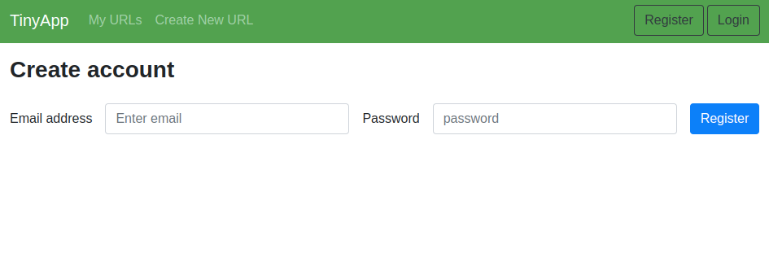
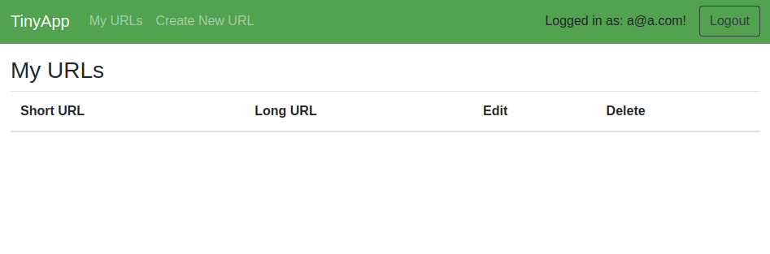
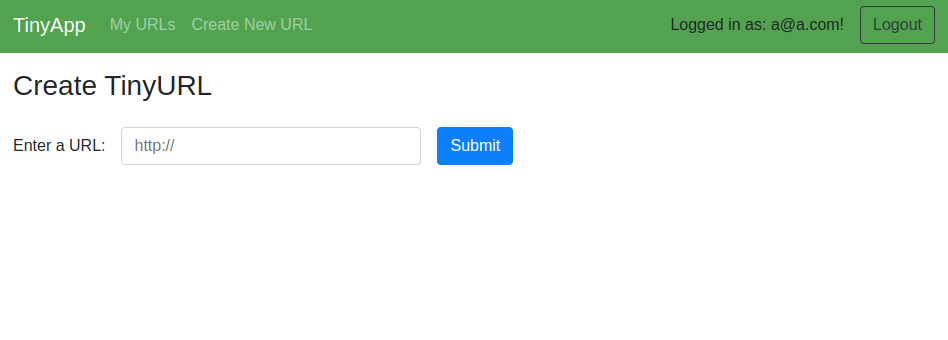
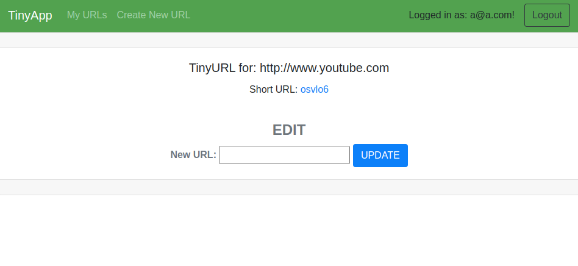
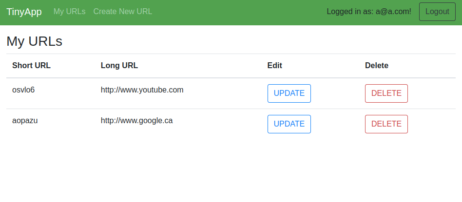

# TinyApp Project

TinyApp is a full stack web application built with Node and Express that allows users to shorten long URLs (à la bit.ly).

## Final Product

Welcome to the registration page! To navigate here simply press the register button on the top right corner of the page, or if you are registered, you can login instead.

After logging in, you will be directed to the main page where your shortURLs will be stored.

You can start creating your shortURLs by clicking the link at the top left corner of the page.

After you create your shortURL, you will see this page where you can navigate to the website linked to the shortURL, or if you want to update the URL associated with it.

Finally when you navigate back to your main page by pressing the My URLs link at the top left corner of the page, you will see all your shortURLs displayed!

## Dependencies

- Node.js
- Express
- EJS
- bcrypt
- body-parser
- cookie-session

## Getting Started

- Install all dependencies (using the `npm install` command).
- Run the development web server using the `node express_server.js` command.